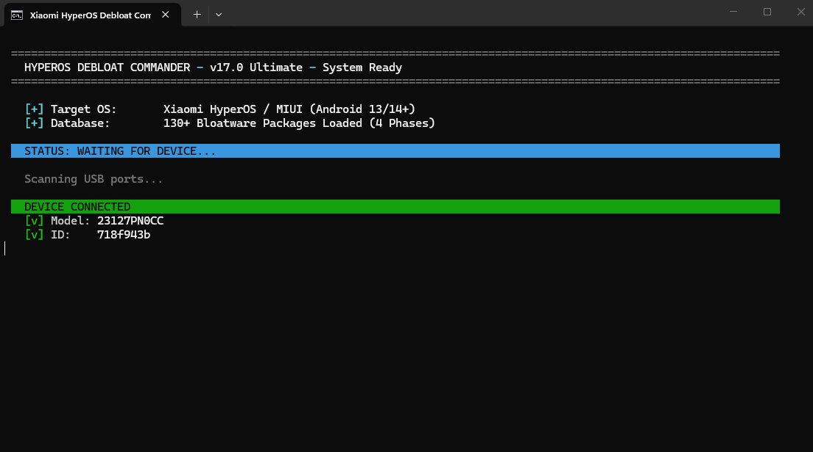
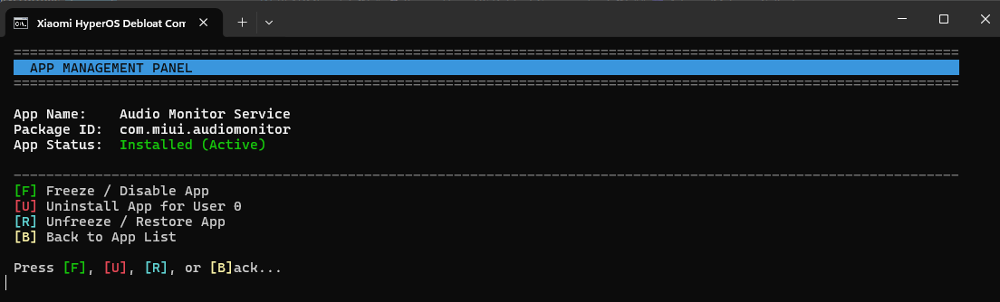
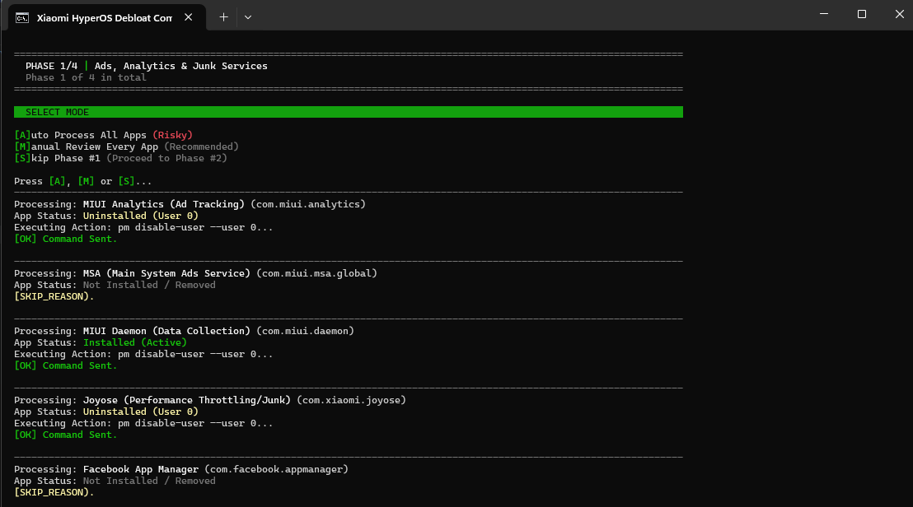
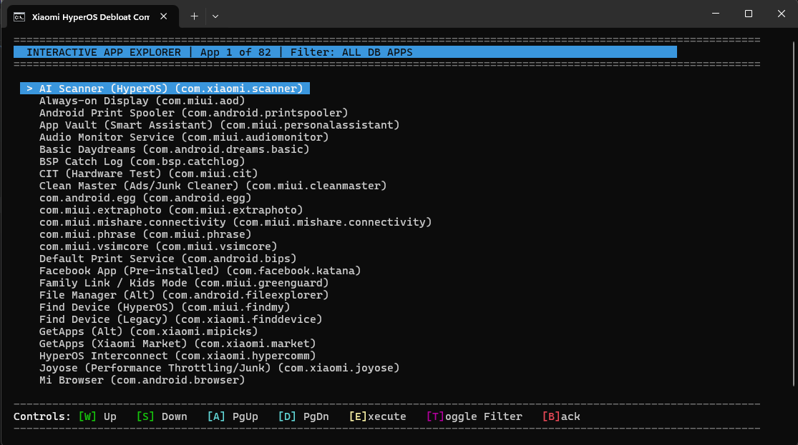
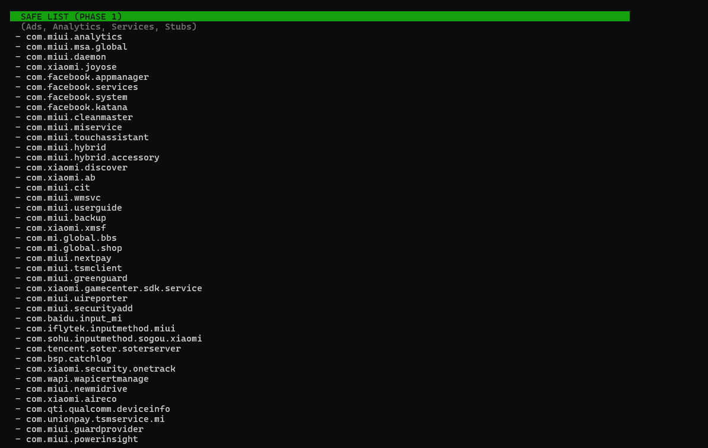
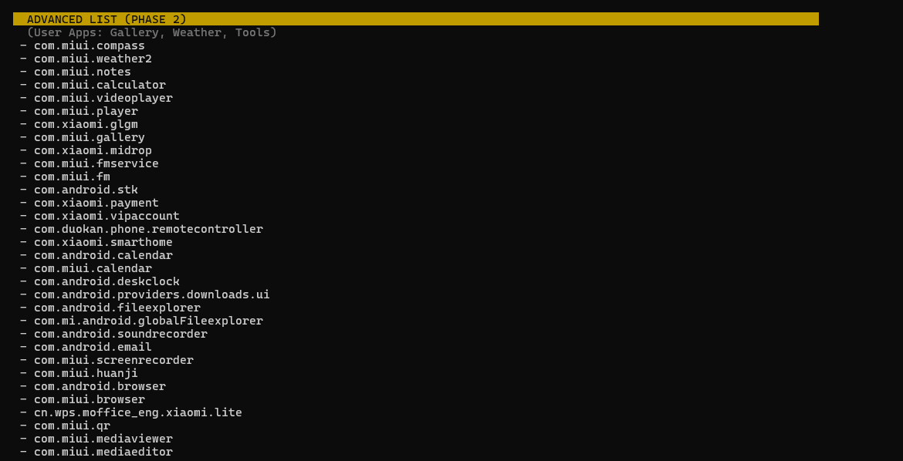
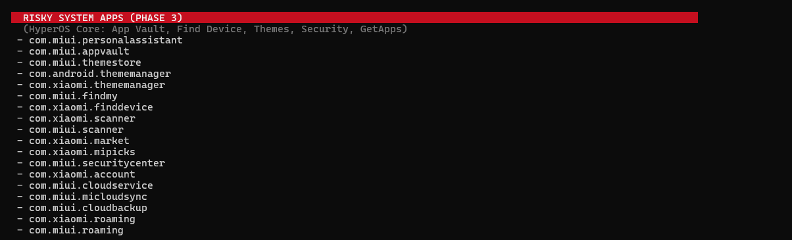
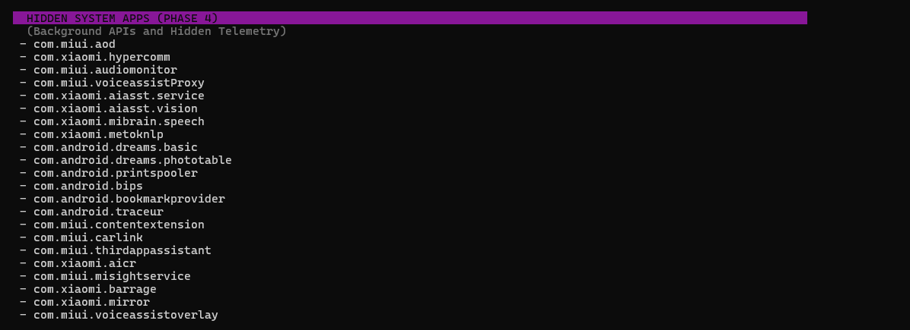

# 🚀 Xiaomi HyperOS Debloat Commander

*A powerful, interactive, and completely reversible Windows batch utility designed to safely eradicate telemetry, intrusive ads, and bloatware from Xiaomi, Redmi, and POCO devices, that supports Android 13+.*

**[NO ROOT REQUIRED]** 

---

After months of testing various approaches, I've built a safe, rootless debloater that effectively removes bloatware without causing bootloops. I'm excited to finally share it with you as an open-source project!

---

## ✨ Key Features

* **🖥️ Interactive App Explorer:** A fully scrollable, alphabetically sorted terminal UI. Browse all database apps installed on your phone, and manually freeze, uninstall, or restore them one by one.
* **📡 Live State Tracking:** Queries your device in real-time to display exact app statuses (`Installed`, `Uninstalled (User 0)`, or `Frozen`).
* **🧠 Smart Filtering:** Automatically bypasses apps already removed from your device, significantly speeding up manual review processes.
* **🛡️ 4-Phase Safety Architecture:** Apps are strictly categorized from completely safe (Ads/Analytics) to highly risky (Core System apps), granting you absolute control over the debloating depth.
* **📝 Granular Logging:** Every action is meticulously recorded to a dynamically generated `.log` log file, complete with your Device Model, ID, and precise timestamps.
* **🔄 100% Reversible:** A built-in Recovery Mode allows you to instantly reinstall or unfreeze *any* app you previously modified.

---

> [!IMPORTANT]  
> **HyperOS (Android 14+) Compatibility Notice**  
> On newer versions of HyperOS, Xiaomi has restricted the standard `pm disable-user` (Freeze) command for system apps, which now throws a `SecurityException`.  
> **The Solution:** This script fully leverages the **Uninstall for User 0** method. It functions identically to a freeze—hiding the app, halting its background processes, and freeing up system resources - while remaining completely reversible.

---

## 📸 Interface Showcase

Experience a clean, highly readable terminal interface designed for maximum efficiency.

---

<strong>📱 Initial Device Detection</strong>

 

---

<strong>⚙️ App Management Workflow</strong>

 

---

<strong>⚡ Automatic Debloating Process</strong>

 

---

<strong>🎯 Manual Debloating (Interactive UI)</strong>

 

---

## 🌩️ Adware & Telemetry Database

The script targets specific tiers of pre-installed software, categorized visually below:

| 🛡️ Database Categories & Previews |
| :--- |
| **🟢 Safe Removals**  **Popular, mostly useless apps that are 100% safe to remove.**  

<strong>View Apps Preview</strong>
 <a href="./data/images/preview/debloat_safe.png" target="_blank"> 🔍 View in Full Size</a>
 |
| **🟡 Advanced Telemetry**  **Trackers utilized by Xiaomi/POCO/Redmi to harvest and share data.**  

<strong>View Apps Preview</strong>
 <a href="./data/images/preview/debloat_advanced.png" target="_blank"> 🔍 View in Full Size</a>
 |
| **🟠 System Bloat**  **Redundant system apps easily replaced by superior, open-source alternatives.**  

<strong>View Apps Preview</strong>
 <a href="./data/images/preview/debloat_system.png" target="_blank"> 🔍 View in Full Size</a>
 |
| **🔴 Hidden Services**  **Obscured background packages that consume resources without providing user value.**  

<strong>View Apps Preview</strong>
 <a href="./data/images/preview/debloat_hidden.png" target="_blank"> 🔍 View in Full Size</a>
 |

---

## 🛠️ Prerequisites

Before running the Commander, ensure your environment is set up:

1. **Windows PC:** Fully tested and supported on Windows 10 & 11.
2. **ADB Installed:** Ensure ADB is added to your system's Environment Variables, *or* simply place `adb.exe` in the exact same folder as the script.
3. **Enable Developer Options & USB Debugging:**
   * Navigate to `Settings` > `About phone` > Tap `OS version` **7 times**.
   * Navigate to `Additional settings` > `Developer options`.
   * Toggle on **USB debugging**.
   * Toggle on **USB debugging (Security settings)** *(Note: This step requires a Mi Account).*

---

## 🚀 Quick Start Guide

1. **Download** the latest release of `HyperOS_Ultimate_v15.bat` from the [Releases](#) tab.
2. **Connect** your device to your PC via USB. *(When prompted on your phone, accept the RSA fingerprint).*
3. **Execute** the `.bat` file as Administrator.
4. The Commander will instantly detect your device hardware and initialize the Main Menu.

### Main Menu Overview

* **`[1]` Standard Debloat (Phases 1-4):** A guided progression through the 4 categorized bloatware phases. You maintain the choice to auto-process, manually scrutinize, or skip each phase entirely.
* **`[2]` Interactive App Explorer:** Boot into a paginated, native UI to surgically manage specific packages.

### The 4 Debloat Phases

* **🟢 PHASE 1 (Safe):** Intrusive ads, analytic engines, background stubs, and junk services (e.g., MSA, MIUI Daemon, Joyose).
* **🟡 PHASE 2 (Caution):** Standard user-facing apps (e.g., Gallery, Weather, App Vault). *Only remove if you already use third-party alternatives.*
* **🟠 PHASE 3 (Risky):** Deeply integrated system apps (e.g., Security Center, Find Device, GetApps). *Warning: Careless removal here may cause bootloops on specific firmware versions.*
* **🔴 PHASE 4 (Hidden):** Obscure background APIs, legacy Android bloat, and core Xiaomi telemetry frameworks.

---

## 🕹️ App Explorer Controls

Navigate the interactive terminal UI with precision using these keybinds:

| Key | Action | Description |
| :---: | :--- | :--- |
| `W` | **Up** | Move cursor up one row |
| `S` | **Down** | Move cursor down one row |
| `A` | **Page Up** | Jump backward 10 applications |
| `D` | **Page Down** | Jump forward 10 applications |
| `E` | **Execute** | Select and manage the currently highlighted app |
| `T` | **Toggle Filter**| Switch view between *All DB Apps* and *Active Apps Only* |
| `B` | **Back** | Return to the previous menu |

---

> [!WARNING]  
> **Disclaimer & Liability:**  
> **Use this tool at your own risk.** While the script categorizes apps by risk level, removing critical core system packages may result in system instability or bootloop on some OS-es. However, I have tested it on exactly hundreds of devices and now it works well. Always research an app package before removing it if you are unsure of its function. I am not responsible for bricked devices, lost data, or voided warranties. However, I hope that nothing like this will happen, because I have tested this solution literally hundreds of times myself :)

## 📜 License

This project is open-source and licensed under the **MIT License**. See the `LICENSE` file for full details.